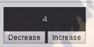

<div style='width: 100%; text-align: center;' align='center'></div>

# Framescript
> A language that compiles to Javascript and HTML with a built-in react-like framework.

## Example
> The following code:
```elm
component[base] {
    style <%
        background-color: rgb(48, 48, 48);
        color: white;
        font-family: Sans-Serif;
        display: inline-block;
        text-align: center;
    %>;

    constructor <%
        me.state['data'] = 0;
    %>;

    component[btn_increase] {
        listen click as e <%
            me.state['data'] = me.state['data'] + 1;
        %>;

        render <%
            <button>Increase</button>
        %>;
    };

    component[btn_decrease] {
        listen click as e <%
            me.state['data'] = me.state['data'] - 1;
        %>;

        render <%
            <button>Decrease</button>
        %>;
    };

    stateChanged as state <%
        me.getElement('data').innerHTML = state['data'];    
    %>;

    render <%
        <div>
            <pre element='data'></pre>
            <component name='btn_decrease'/>
            <component name='btn_increase'/>
        </div>
    %>;
};
```
> Becomes this:


## Usage
> To use it, simply run this command to transpile / compile:

    framescript --input <your-file> --output <your-output-file>

> The output is a `html` file that can be opened with your browser.

> You can also have the output minified by running
> the command with the `--minify` flag.

## Install
> Clone down the repository and run:

    python setup.py install

> Now, you might have to run that with `sudo`.
